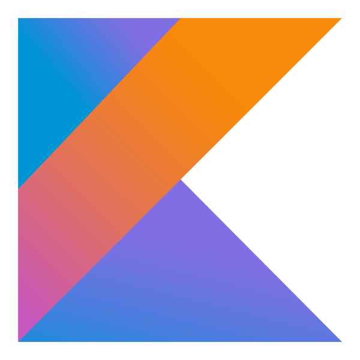

#### Hey, I'm Alberto! 
👨‍💻 JavaScript, Python, Kotlin, Java, CSS and MySQL. 
🥅 Next Goals: Big Data, AI and Blockchain. 

<!-- 👯 I’m looking to collaborate with other content creators.  -->
<!-- GitHub Stats:
 
  -->

<strong>Skills:</strong> 

